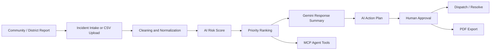
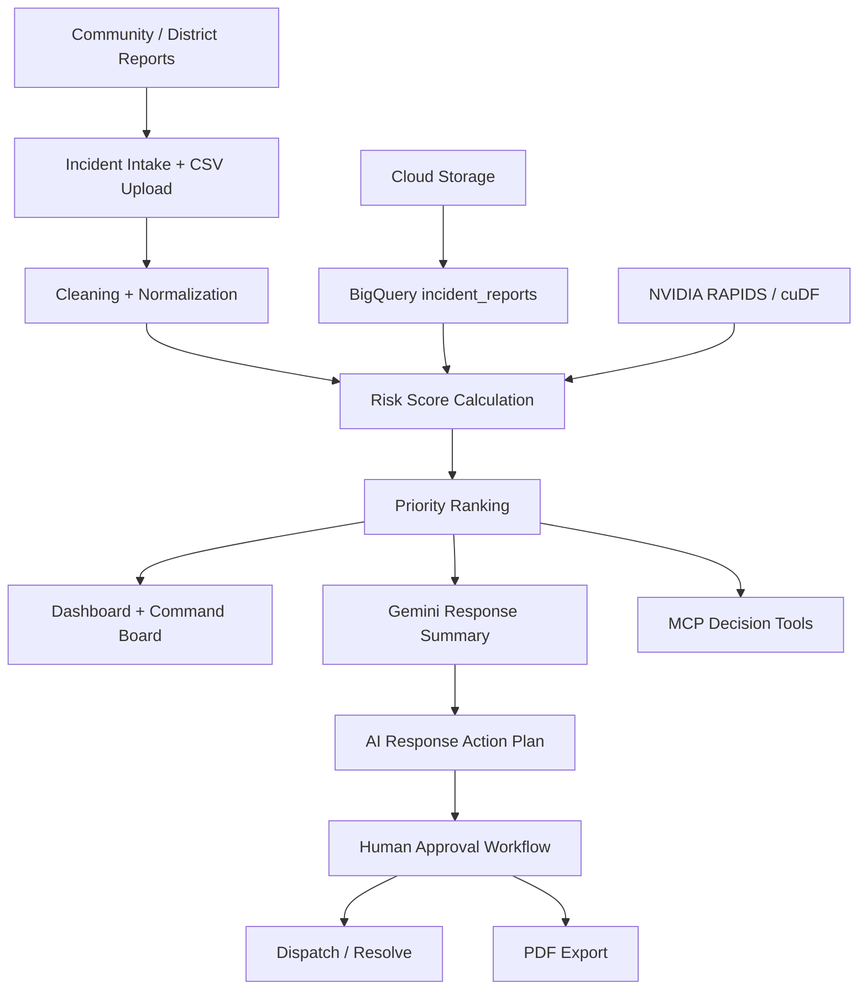
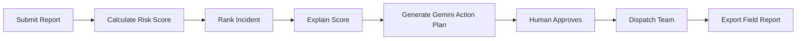

<div align="center">

# 🚨 Pacific Response Intelligence

### AI-powered emergency decision intelligence for Fiji & Pacific communities

**From scattered community reports → AI risk score → Gemini action plan → human approval → field response**

<br />

[](https://drua.shivafj.dev)
[](https://drua.shivafj.dev/mcp)
[](#technology-stack)
[](#acceleration-proof)
[](#refinement-phase)

<br />

**Hackathon:** Google Cloud Gen AI Academy APAC Edition — Cohort 2  
**Phase:** Prototype Refinement Phase  
**Team:** Abhishek Swamy, Shiva Goundar, Pranav  

</div>

---

## 🌊 Overview

**Pacific Response Intelligence** is a high-fidelity emergency decision-support prototype for Fiji and wider Pacific communities.

During cyclones, floods, landslides, water shortages, health risks, and other community incidents, emergency operations teams receive information from many different channels: village reports, radio calls, SMS updates, district spreadsheets, NGOs, public services, field officers, hospital updates, and social media.

The problem is not only collecting data.

The real problem is deciding:

> **Of all the incidents happening right now, which one should the next available team be sent to, and why?**

Pacific Response Intelligence transforms fragmented community reports into a ranked, explainable, and human-approved response workflow using **Google Cloud**, **Gemini**, and **NVIDIA RAPIDS/cuDF acceleration**.

---

## 🔗 Live Endpoints

| Resource | Link |
|---|---|
| 🌐 Dashboard | [https://drua.shivafj.dev](https://drua.shivafj.dev) |
| 🤖 MCP endpoint for AI agents | [https://drua.shivafj.dev/mcp](https://drua.shivafj.dev/mcp) |

---

## 🏆 Hackathon Context

Pacific Response Intelligence was built for the **Google Cloud Gen AI Academy APAC Edition — Cohort 2 Hackathon**.

The project was shortlisted among the **Top 101 teams out of 1500+ participating teams** and advanced into the **Prototype Refinement Phase**.

For the refinement phase, the product was extended from a monitoring dashboard into a full operational workflow:

```text
Decide → Approve → Act
```

---

## 🎯 The Problem

When a cyclone, flood, or landslide hits Fiji and the wider Pacific, emergency operations centers can be flooded with fragmented information:

- SMS reports from villages
- Radio calls from district officers
- Weather and environmental updates
- Hospital or health reports
- NGO field updates
- Social media chatter
- Spreadsheets from multiple districts

A duty officer in Suva may have to decide within minutes:

- Which village should receive the last available rescue boat?
- Should Rakiraki or Ba be evacuated first?
- Where is a water shortage most likely to become a health crisis in the next 24 hours?
- Which road blockage will delay the most urgent response?

Today, these decisions are often made by scrolling through spreadsheets, WhatsApp groups, and phone calls.

The data exists, but it is usually:

- Slow
- Fragmented
- Unranked
- Not explainable
- Not decision-ready
- Difficult to share with field teams

In emergency response, delays in prioritization can mean the right help reaches the wrong place too late.

---

## 👥 The Users

| User | Need |
|---|---|
| **Emergency Operations Center duty officers** | Decide which area needs help first |
| **District Disaster Coordinators** | See a live ranked view of incidents in their district |
| **NGO and Red Cross field teams** | Deploy limited boats, medical teams, water trucks, and supplies |
| **Government and ministry stakeholders** | View response status, trends, and summary reports |
| **AI agents and downstream systems** | Access structured decision intelligence through MCP instead of scraping the UI |

---

## ⚡ The Decision We Accelerate

> **“Of all the incidents happening right now, which one should the next available team be sent to, and why?”**

This is a **ranking + explanation + approval** problem under time pressure.

Every minute spent manually triaging reports is a minute where a rescue team, boat, water truck, or medical team may be waiting for direction.

Pacific Response Intelligence reduces time-to-insight by turning raw reports into:

- Risk scores
- Ranked priority lists
- Gemini-generated response summaries
- AI action plans
- Human-approved status workflows
- Field-ready PDF exports
- Agent-callable MCP tools

---

## 🧠 What We Built

Pacific Response Intelligence is a decision-support dashboard plus an agent-callable API that ingests community emergency reports, scores them, ranks them, and generates response guidance for emergency operations teams.

It is designed around this workflow:

```text
Report → Clean → Score → Rank → Explain → Plan → Approve → Dispatch
```



---

# Refinement Phase

The dashboard was extended from a monitoring surface into an end-to-end **decide → approve → act** workflow.

## ✅ Refinement Additions

### 1. 📥 Incident Intake Flow

A **Submit Report** dialog sits next to the CSV importer.

It captures:

- Area
- Issue type
- Severity
- Urgency
- Road access
- Resource status
- Reporter type
- People affected
- Free-text description

On submit:

- The AI risk score is computed from those fields
- The report is added directly into the live queue
- The report starts with status **New**
- Dashboard stats, charts, table, and command board update

---

### 2. 🧭 AI Response Action Plan

The area side panel renders a numbered **3–5 step plan** generated by the Gemini AI Agent.

Each plan is derived from:

- Incident severity
- People affected
- Road access
- Resource status
- Issue type
- Urgency level

Each step includes:

- Action
- ETA badge
- Operational reason
- Field note

Example:

```text
1. Dispatch flood response team to Rakiraki — ETA: Immediate
2. Send water and evacuation support — ETA: 30 minutes
3. Coordinate alternate access route due to blocked roads — ETA: 1 hour
```

---

### 3. ✅ Human Approval Workflow

Every report has an explicit status:

```text
New → Under Review → Approved → Dispatched → Resolved
```

Available actions include:

- Send to Review
- Approve
- Mark Dispatched
- Mark Resolved

Status controls are available in:

- Area side panel
- Priority response table
- Command board cards

The product follows a responsible decision model:

> **AI recommends. A human always approves.**

---

### 4. 🔁 Situation Change Summary

A running card lists every report whose risk or severity moved since the last snapshot.

It includes:

- Risk score delta
- Severity movement
- Up/down indicator
- Priority movement
- Approval activity log for the current session

Example:

```text
Rakiraki increased from 82 to 96 because road access became blocked,
resources dropped to Low, and affected population increased.
```

---

### 5. 🧩 Command Board

A Kanban-style board groups reports by status.

Columns:

- New
- Under Review
- Approved
- Dispatched
- Resolved

Each card shows:

- Area
- Severity
- Risk score
- Urgency
- Status picker

The command board complements the ranked table with a pipeline view of response progress.

---

### 6. 📄 Richer PDF Export

The exported response report now includes:

- Status column
- Changes since last update
- Gemini summary
- AI Response Action Plan for the top 3 priorities
- Current priority list
- Timestamp
- Approval/status information

This makes the export useful for field teams, briefings, and operations handover.

---

### 7. 🧪 What-If Response Simulator

Duty officers can pick any live incident and simulate changes:

- Severity
- Urgency
- Road access
- Resource status
- People affected

The system updates in real time:

- AI risk score
- Ranking position
- Priority movement
- Plain-language explanation

Example:

```text
Rakiraki increased from 82 to 96 because road access became blocked,
resources dropped to Low, and affected population increased.
```

This helps duty officers stress-test decisions before committing limited resources.

---

### 8. 🚚 Resource Allocation Optimizer

Users can enter available resources:

- Response teams
- Water trucks
- Medical kits
- Evacuation vehicles
- Road-clearance crews

The optimizer distributes them across the top 5 open incidents by risk.

For each area, it shows:

- Assigned resources
- Reason for allocation
- Urgency
- Suggested next action

This moves the product beyond “which area is worst?” to “what should we send and where?”

---

### 9. 🔍 Explainable Risk Score Breakdown

Every incident side panel includes a **Why this score?** section.

It shows the exact contribution of:

- Severity
- Population affected
- Urgency
- Resource shortage
- Road access

Each factor is shown with visual bars, percentages, and a plain-language explanation.

This makes the ranking transparent, auditable, and easier for human coordinators to trust.

---

## 🧮 Risk Score Formula

The AI Risk Score is calculated from five operational factors:

| Factor | Weight |
|---|---:|
| Severity | 35% |
| Population affected | 25% |
| Urgency | 20% |
| Resource shortage | 10% |
| Road access constraint | 10% |

```text
Risk Score =
  Severity Score × 0.35
+ Population Score × 0.25
+ Urgency Score × 0.20
+ Resource Shortage Score × 0.10
+ Road Access Score × 0.10
```

Example:

```text
Critical flooding + high affected population + blocked road access + low resources
= high priority risk score
```

---

## 🗂️ Ingestion

The prototype supports multiple incident intake paths:

- Manual incident intake form
- CSV upload for district reports
- Sample CSV loader
- Designed Cloud Storage landing zone for batch drops from districts and NGOs

The CSV importer is designed to tolerate messy real-world formats that officers may send during an emergency.

Structured incident schema:

```text
report_id
area
issue_type
severity
people_affected
urgency_level
resource_status
road_access
created_at
severity_score
resource_score
road_score
population_score
risk_score
recommended_action
status
description
reporter_type
```

---

## 🧹 Pipeline: Cleaning, Modeling, Ranking

The pipeline performs:

- Severity normalization
- Area-name normalization
- Numeric field parsing
- Resource status mapping
- Road access mapping
- Risk score calculation
- Top-N priority ranking
- Rollups by area
- Rollups by issue type

The output is designed to be decision-ready rather than just data-rich.

---

## ☁️ Google Cloud Data Layer

Pacific Response Intelligence uses Google Cloud as the data and application layer.

### Cloud Storage

Cloud Storage is used as the designed landing zone for district and NGO CSV uploads.

Demo artifact:

```text
gs://pri-incident-data-shiva/pacific_response_incidents.csv
```

### BigQuery

BigQuery stores structured incident data and supports top-N and rollup queries.

Demo resources:

```text
Dataset:
pacific_response_intelligence

Table:
incident_reports
```

Example top-priority query:

```sql
SELECT
  area,
  issue_type,
  severity,
  people_affected,
  resource_status,
  road_access,
  risk_score,
  recommended_action,
  created_at
FROM
  `gen-lang-client-0829931742.pacific_response_intelligence.incident_reports`
ORDER BY
  risk_score DESC
LIMIT 10;
```

Example area rollup query:

```sql
SELECT
  area,
  COUNT(*) AS total_reports,
  ROUND(AVG(risk_score), 2) AS avg_risk_score,
  MAX(risk_score) AS highest_risk_score,
  SUM(people_affected) AS total_people_affected
FROM
  `gen-lang-client-0829931742.pacific_response_intelligence.incident_reports`
GROUP BY
  area
ORDER BY
  avg_risk_score DESC;
```

These artifacts prove that the product is more than a static dashboard. It has a real data intelligence layer.

---

## 🚀 Acceleration Proof

This project includes an NVIDIA RAPIDS/cuDF benchmark for the priority risk-scoring and incident-ranking pipeline.

### Benchmark Result

| Metric | Result |
|---|---:|
| Dataset size | 2,000,000 emergency reports |
| Traditional pandas | 1.4007 seconds |
| NVIDIA RAPIDS/cuDF | 0.1228 seconds |
| GPU | NVIDIA Tesla T4 |
| Speedup | **11.40x faster** |

Benchmark artifact:

```text
rapids-benchmark-proof.png
```

### Why Acceleration Matters

This is not acceleration for a leaderboard.

In a disaster, the value of an insight decays by the minute.

Faster processing means:

- Lower time-to-insight
- Faster live refreshes
- Better operational responsiveness
- Faster prioritization
- Less manual triage delay
- Quicker deployment of limited resources

```text
Faster data processing → faster ranking → faster decision → faster response
```

---

## 📊 Operational Responsiveness

| Stage | Without acceleration | With RAPIDS + GPU on GCP |
|---|---|---|
| Score and rank large incident feeds | Slower pandas-based workflow | GPU-accelerated scoring and ranking |
| Refresh live rollups as reports arrive | Noticeable batch delay | Faster “live” dashboard feel |
| Analyze multi-season archives | Long-running historical processing | Designed path for accelerated historical calibration |
| Update priority recommendations | Manual or delayed | Faster time-to-insight |

In our benchmark, the priority risk-scoring and incident-ranking workflow ran **11.40x faster** with NVIDIA RAPIDS/cuDF on a Tesla T4 GPU.

---

## 🧠 Intelligence Layer

Gemini is used to generate human-readable decision support.

Gemini-generated outputs include:

- Response summary
- Area prioritization explanation
- Resource recommendations
- Next action
- AI response action plan

The prompt is grounded strictly on the ranked incident list to avoid hallucinated areas or invented casualty numbers.

The live Gemini summary button remains the only network AI call, keeping the rest of the workflow offline-capable for demo stability.

---

## 🖥️ Output

The dashboard provides a clean, deep-blue enterprise interface with:

- Situation overview cards
- Total reports
- High-risk areas
- People affected
- Teams available
- Risk trend chart
- People affected by area chart
- Ranked priority response table
- Area detail side panel
- Gemini-generated response summary
- AI response action plan
- Explainable risk breakdown
- What-if simulator
- Resource allocation optimizer
- Human approval workflow
- Command board
- PDF export
- Agent-ready MCP tools

---

## 🤖 Agent-Ready Decision Tools: MCP

The same decision intelligence is exposed through a **Model Context Protocol endpoint** at:

```text
https://drua.shivafj.dev/mcp
```

This allows AI agents and future emergency systems to call the product directly without scraping the dashboard UI.

### Available Tools

| Tool | Purpose |
|---|---|
| `list_priority_reports` | Returns ranked incidents, filterable by severity and limit |
| `get_area_status` | Returns current risk, status, and recommended action for a selected area |
| `response_summary` | Returns Gemini-authored situational summary plus top-line stats |

This turns the dashboard into a service, not just a page.

### Example: List Tools

```json
{
  "jsonrpc": "2.0",
  "id": 1,
  "method": "tools/list"
}
```

### Example: Call `list_priority_reports`

```json
{
  "jsonrpc": "2.0",
  "id": 2,
  "method": "tools/call",
  "params": {
    "name": "list_priority_reports",
    "arguments": {
      "limit": 5,
      "minSeverity": "Critical"
    }
  }
}
```

### Example: Call `get_area_status`

```json
{
  "jsonrpc": "2.0",
  "id": 3,
  "method": "tools/call",
  "params": {
    "name": "get_area_status",
    "arguments": {
      "area": "Rakiraki"
    }
  }
}
```

### Example: Call `response_summary`

```json
{
  "jsonrpc": "2.0",
  "id": 4,
  "method": "tools/call",
  "params": {
    "name": "response_summary",
    "arguments": {
      "limit": 5
    }
  }
}
```

---

## 🏗️ Architecture



---

## 🔄 Core Workflow



---

## 🛠️ Technology Stack

### Google Cloud Data & Application Layer

| Service | Use |
|---|---|
| **Cloud Storage** | District CSV drop zone and incident data landing area |
| **BigQuery** | Structured incident table, top-N queries, area rollups, issue rollups |
| **Gemini API / Gemini-powered agent** | Plain-language response summaries and action plans |
| **Looker-ready aggregates** | Designed reporting surface for ministries, donors, and executive summaries |
| **Managed Service for Apache Spark** | Designed future path for large historical incident calibration |

---

### NVIDIA Acceleration Layer

| Technology | Use |
|---|---|
| **NVIDIA RAPIDS** | GPU-accelerated data processing |
| **cuDF / cudf.pandas** | Accelerated scoring and ranking workflow |
| **NVIDIA Tesla T4 GPU** | Benchmark acceleration environment |
| **RAPIDS Accelerator for Apache Spark** | Designed future path for accelerated Spark workloads |

---

### Application Layer

| Technology | Use |
|---|---|
| **TanStack Start** | React application framework |
| **React 19** | Frontend UI |
| **Vite** | Development and build tooling |
| **Tailwind CSS v4** | Styling |
| **shadcn/ui** | UI components |
| **Recharts** | Charts and visualizations |
| **jsPDF + jspdf-autotable** | PDF report export |
| **lucide-react** | Icons |
| **MCP / JSON-RPC** | Agent-ready decision tools |

---

## 📸 Prototype Snapshots

Add screenshots to:

```text
docs/screenshots/
```

Recommended screenshot files:

```text
docs/screenshots/dashboard-overview.png
docs/screenshots/incident-intake.png
docs/screenshots/priority-table.png
docs/screenshots/area-side-panel.png
docs/screenshots/ai-action-plan.png
docs/screenshots/why-this-score.png
docs/screenshots/what-if-simulator.png
docs/screenshots/resource-optimizer.png
docs/screenshots/command-board.png
docs/screenshots/situation-change-summary.png
docs/screenshots/acceleration-proof.png
docs/screenshots/bigquery-proof.png
docs/screenshots/mcp-tools.png
docs/screenshots/pdf-export.png
```

Example:

```markdown

```

---

## 🖥️ Local Development

### Prerequisites

```text
Node.js 18+
npm or pnpm
Gemini API key
```

### Clone Repository

```bash
git clone <your-repo-url>
cd pacific-response-intelligence
```

### Install Dependencies

```bash
npm install
```

or:

```bash
pnpm install
```

### Environment Variables

Create a `.env.local` file:

```env
GEMINI_API_KEY=your_gemini_api_key_here
```

Do not expose this key in frontend components.

### Run Development Server

```bash
npm run dev
```

Open:

```text
http://localhost:5173
```

### Build

```bash
npm run build
```

---

## 📦 Suggested Repository Structure

```text
.
├── public/
│   ├── acceleration-benchmark.json
│   ├── rapids-benchmark-proof.png
│   └── sample-data/
├── src/
│   ├── components/
│   ├── routes/
│   ├── data/
│   ├── lib/
│   └── styles/
├── docs/
│   ├── screenshots/
│   ├── bigquery/
│   └── benchmark/
├── README.md
└── package.json
```

---

## 🎬 Recommended Demo Flow

```text
1. Open the dashboard
2. Submit a new report for Rakiraki
3. Show automatic risk score calculation
4. Show the report entering the live queue with status New
5. Open the side panel and show “Why this score?”
6. Run the What-If Response Simulator
7. Generate Gemini AI Response Action Plan
8. Use Resource Allocation Optimizer
9. Approve the recommended response
10. Move the incident to Dispatched
11. Show the Command Board status movement
12. Export the response PDF
13. Show NVIDIA RAPIDS 11.40x acceleration proof
14. Show BigQuery + Cloud Storage data layer
15. Show MCP agent-ready tools
```

---

## 🌺 Impact

Pacific Response Intelligence is designed for Pacific and small-island emergency contexts where:

- Resources are limited
- Reports arrive from many sources
- Weather events evolve quickly
- Districts may rely on spreadsheets and radio updates
- Decision makers need clear priorities
- Field teams need simple, actionable instructions

The product helps turn scattered reports into faster, clearer, and more accountable emergency response decisions.

---

## 👨‍💻 Team

| Name | Role |
|---|---|
| **Abhishek Swamy** | Team Lead / Product + Engineering |
| **Shiva Goundar** | Engineering / AI + Cloud + Product Refinement |
| **Pranav Kumar** | Engineering / Data + Prototype Development |

---

## 📌 Final One-Liner

> **Pacific Response Intelligence helps emergency teams move from fragmented community reports to approved response actions using BigQuery, Gemini, and NVIDIA RAPIDS acceleration.**

---

<div align="center">

### Built for faster, smarter, and more resilient Pacific emergency response 🌊

</div>
